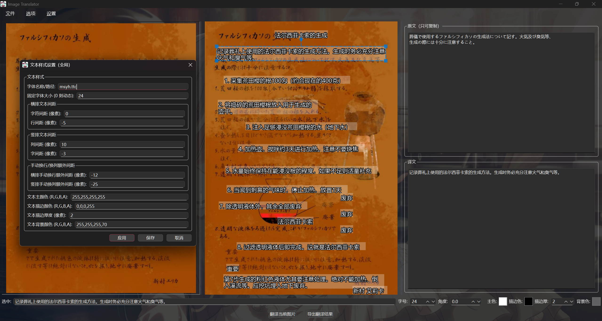
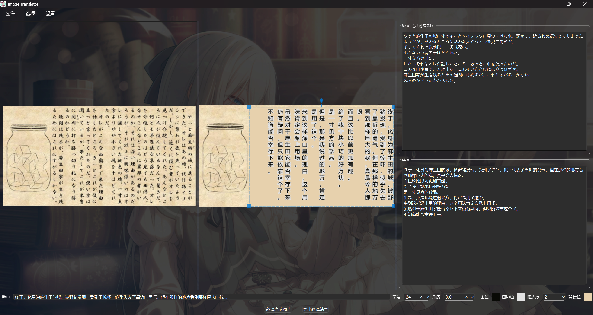
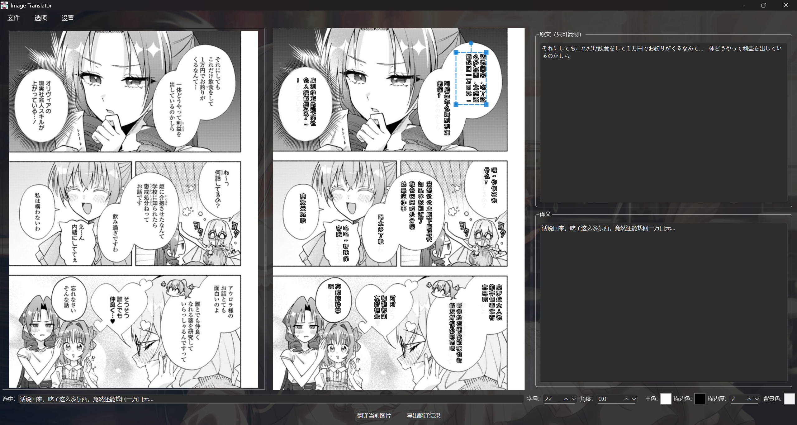

# Image Translator

<!-- Language Switcher -->

  <a href="#chinese-version">🇨🇳 中文</a> | <a href="#english-version">🇬🇧 English</a>

<!-- Chinese Version (Default) -->

## 图像翻译器

### 🚀 安装与运行 (可选)

[请在此处填写中文安装和运行指南]

例如：
0.  安装python，版本≥3.10
1.  下载项目代码
2.  解压，进入有main.py的主目录
3.  右键使用powershell以及pip安装依赖:pip install -r requirements.txt
4.  在powershell中运行: python main.py
5.  配置API，OCR和翻译都选gemini，默认的就行，模型推荐：gemini-2.5-flash-preview-04-17-thinking
6.  默认base_url:https://generativelanguage.googleapis.com/v1beta/openai/
7.  代理需要设置你自己的端口号以及地址

*   **效果预览:**
    
    
    
    

<!-- English Version (Collapsible) -->

<h2>🇬🇧 English Version</h2> (Click to expand)

 

Image Translator is a desktop application built with PyQt6, designed to facilitate the optical character recognition (OCR) and translation of text embedded within images. It provides an interactive environment for users to load images, process them using various AI-powered services, and meticulously edit the resulting translated text overlays.

*   **Sample Images:**
    
    
    
    

---

### ✨ Key Features:

*   **Flexible Image Loading:**
    *   Load single images for detailed, interactive translation.
    *   Batch process multiple images for efficient bulk translation and export.
*   **Advanced OCR Capabilities:**
    *   **Primary OCR with Gemini:** Utilizes Google's Gemini model (via its OpenAI-compatible API) for integrated multi-modal OCR and translation, or as a standalone OCR step.
    *   **Fallback OCR Options:**
        *   Google Cloud Vision API.
        *   Local PaddleOCR (supports multiple languages, including Japanese).
    *   Users can select their preferred primary and fallback OCR providers.
*   **Versatile Translation Services:**
    *   **Primary Translation with Gemini:** Leverages Gemini for text translation, either as part of the multi-modal OCR process or as a separate step for text extracted by other OCR engines.
    *   **Fallback Translation with Local LLM:** Supports translation via a local Large Language Model API (e.g., compatible with Sakura, Llama.cpp server endpoints).
    *   Provider preferences are configurable.
*   **Interactive Text Block Manipulation:**
    *   **Visual Editing:** Directly on a preview of the image, users can:
        *   **Select** individual text blocks.
        *   **Move** text blocks to new positions.
        *   **Resize** the bounding box of text blocks.
        *   **Rotate** text blocks to any angle.
    *   **Content Editing:**
        *   Edit translated text via a dedicated detail panel or an in-place dialog.
        *   View original (OCR'd) text alongside the translation.
    *   **Add/Delete Blocks:** Create new text blocks manually or delete existing ones.
*   **Comprehensive Text Styling:**
    *   **Font Customization:** Choose system fonts or provide font file paths.
    *   **Font Size:** Set a fixed font size or allow dynamic sizing based on LLM suggestions.
    *   **Colors:** Customize main text color, outline color, and text background color (all with RGBA support).
    *   **Outline:** Control the thickness of the text outline.
    *   **Spacing:** Adjust horizontal character/line spacing and vertical character/column spacing.
    *   **Orientation & Alignment:** Set text orientation (horizontal, vertical LTR/RTL) and alignment (left, center, right) per block.
*   **Configuration and Customization:**
    *   **API & Proxy Settings:** Dedicated dialog to manage API keys (Gemini, Google), provider choices, model names, timeouts, and HTTP/HTTPS proxy settings.
    *   **Glossary Management:** Create, import, and export a glossary for consistent terminology when using the local LLM translator.
    *   **UI Personalization:** Change the main window's background image and application icon.
    *   All settings are persisted in a `config.ini` file.
*   **User Experience:**
    *   **Graphical User Interface:** Built with PyQt6 for a responsive desktop experience.
    *   **Progress Indication:** Visual feedback with progress bars and status messages for long-running operations (image processing, batch translation).
    *   **Cancellable Operations:** Ability to cancel ongoing single or batch processing tasks.
    *   **Export Functionality:** Save the final image with all translated and styled text blocks rendered onto it.

---

### 🛠️ Tech Stack (Optional)

*   Python 3.x
*   PyQt6
*   Google Gemini API
*   Google Cloud Vision API (Optional)
*   PaddleOCR (Optional)
*   Local LLM API (Optional)

---

### 🚀 Installation & Usage (Optional)

[Provide English installation and usage instructions here]

Example:
1.  Clone the repository: `git clone https://your-repo-url.git`
2.  Navigate to the directory: `cd image-translator`
3.  Install dependencies: `pip install -r requirements.txt`
4.  Run the application: `python main.py`

---

### ⚙️ Configuration (Optional)

[Provide English configuration details here, e.g., how to set up API keys]

---

### 🤝 Contributing (Optional)

[Provide English contribution guidelines here]

---

### 📄 License (Optional)

[State your project license here, e.g., This project is licensed under the MIT License.]

